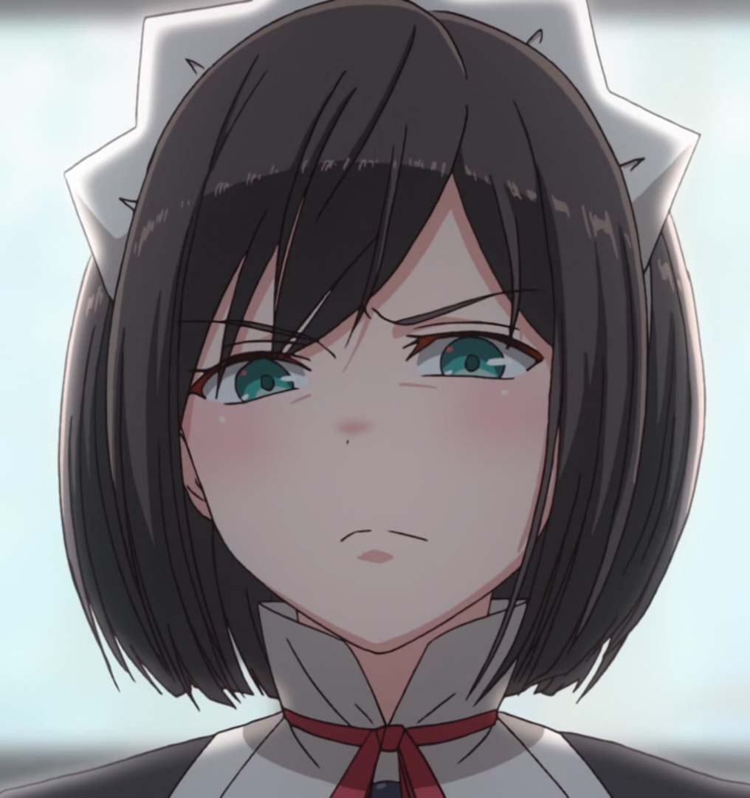

    
  

## 
Hi, I'm egor715😊

### 🚀About Me
- 🏫 Undergraduate student in [NEU](http://www.neu.edu.cn/), China.
- 💘 Recently working on computer vision.
- 🔌 C++/Python/Matlab
- 🤖 Interested in Artificial Intelligence, Robotics.
- 🐕‍🦺 I like watching anime and raising pets(especially cats).
- 📬 You can contact me at <yhliu7@foxmail.com>

<!--
**egor715/egor715** is a ✨ _special_ ✨ repository because its `README.md` (this file) appears on your GitHub profile.

Here are some ideas to get you started:

- 🔭 I’m currently working on ...
- 🌱 I’m currently learning ...
- 👯 I’m looking to collaborate on ...
- 🤔 I’m looking for help with ...
- 💬 Ask me about ...
- 📫 How to reach me: ...
- 😄 Pronouns: ...
- ⚡ Fun fact: ...
-->
